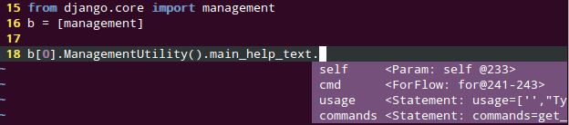

.. include global.rst

Jedi - an awesome autocompletion library for Python
===================================================

Release v\ |release|. (:doc:`Installation <docs/installation>`)

.. automodule:: jedi

Autocompletion can look like this (e.g. VIM plugin):

.. _toc:

Docs
----

.. toctree::
   :maxdepth: 1

   docs/installation
   docs/features
   docs/recipes
   docs/plugin-api
   docs/history
   docs/development
   docs/testing

.. _resources:

Resources
---------

- `Source Code on Github <https://github.com/davidhalter/jedi>`_
- `Travis Testing <https://travis-ci.org/davidhalter/jedi>`_
- `Python Package Index <http://pypi.python.org/pypi/jedi/>`_

.. _editor-plugins:

Editor Plugins
--------------

- `Vim <http://github.com/davidhalter/jedi-vim>`_
- `Emacs <https://github.com/tkf/emacs-jedi>`_
- `Sublime Text 2 <https://github.com/svaiter/SublimeJEDI>`_

.. _other-software:

Other Software Using Jedi
-------------------------

- `wdb <https://github.com/Kozea/wdb>`_
